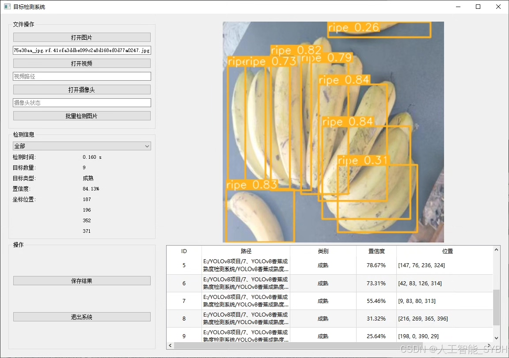
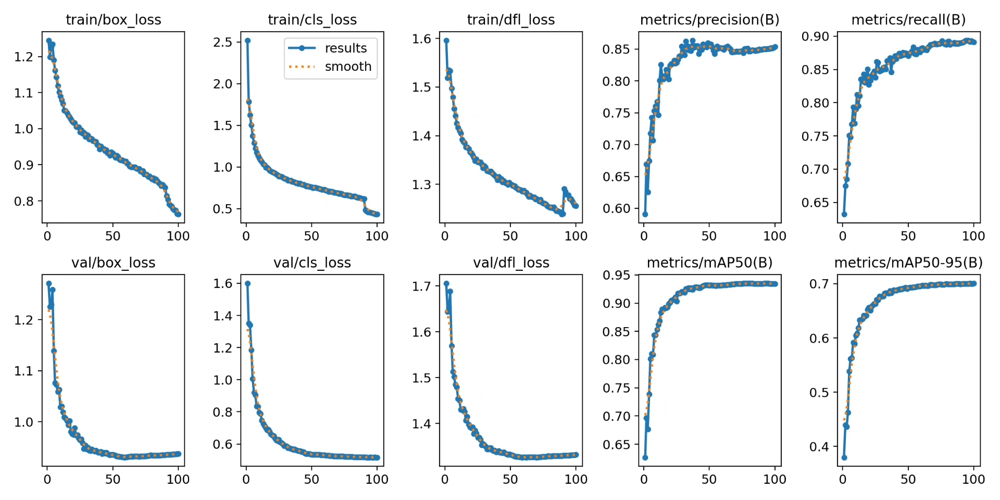
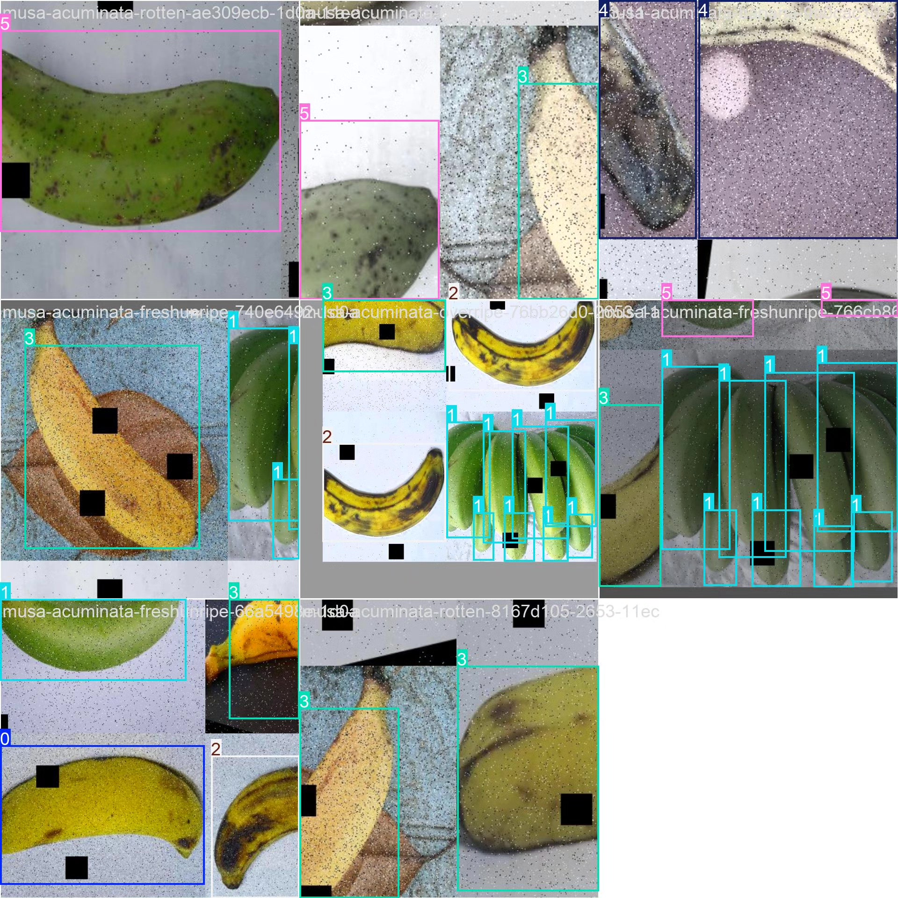

# Banana ripeness detection system based on YOLOv8 deep learning (YOLOv8+)

## Body

Based on the YOLOv8 deep learning algorithm, a banana ripeness detection system has been developed. This project uses the YOLOv8 target detection algorithm to accurately identify and classify six ripeness states of bananas: fresh ripe (freshripe), fresh unripe (freshunripe), overripe (overripe), ripe (ripe), rotten (rotten), and unripe (unripe). The system is trained using a large-scale banana image dataset, including 15,792 training images, 1,525 validation images, and 757 test images, ensuring robust recognition of various ripeness levels of bananas. The system can perform real-time, non-contact detection of banana ripeness with an accuracy rate exceeding 90%, providing intelligent solutions for banana picking, sorting, storage, and sales.

The company's products have obtained YOLO official commercial license certification.

We offer after-sales service.

After payment, we will provide WeChat ID for any questions.

Environment configuration: We will provide a tutorial on environment configuration, and WeChat will provide answers to questions.

Remote installation service: If you need remote configuration, an additional fee of 69 is required,
failure in configuration will result in all fees being refunded (only installation fee refunded for older computers)

Retraining dataset: After setting up the environment, you can train on your own computer.
If you need us to retrain, just pay 69 + computing power fee (2.5 yuan/hour)

## Images

## Payment

Here is a pay link on Stripe ( https://buy.stripe.com/3cs8yP7sY87d0vu9AB ). Please contact me lonlonago@foxmail.com after funding $89, and I will send you a complete data files , thank you!

